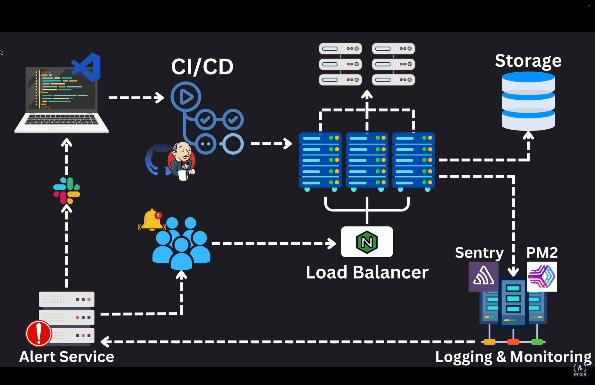

# System Design

- It's about architecting scalable, reliable, and efficiency systems
- It handles: large-scale traffic to optimizing databases

## Table of Contents

- [1. Main Concepts Overview](#1-main-concepts-overview)
  - [1.1. Scalability](#11-scalability)
  - [1.2. Load balancing](#12-load-balancing)
  - [1.3. Database design](#13-database-design)
  - [1.4. Caching](#14-caching)
  - [1.5. Message queues and event-driven architecture](#15-message-queues-and-event-driven-architecture)
  - [1.6. Microservices vs. Monoliths](#16-microservices-vs-monoliths)
  - [1.7. Consistency & Availability (CAP Theorem)](#17-consistency--availability-cap-theorem)
  - [1.8. CDN & Edge computing](#18-cdn--edge-computing)
  - [1.9. Security and authentication](#19-security-and-authentication)
  - [1.10. Observability & Monitoring](#110-observability--monitoring) -[2. Computer architecture](#2-computer-architecture)
  - [2.1. Storage: where data is stored](#21-storage-where-data-is-stored)
    - [2.1.1. Hard drive (non-volatile)](#211-hard-drive-non-volatile)
    - [2.1.2. RAM (Random access memory) (volatile)](#212-ram-random-access-memory-volatile)
    - [2.1.3. Cache](#213-cache)
  - [2.2. CPU: where data is processed](#22-cpu-where-data-is-processed)
  - [2.3. Motherboard](#23-motherboard)
- [3. High-level Architecture of a Production App](#3-high-level-architecture-of-a-production-app)
  - [3.1. CI/CD: Continuous Integration/Continuous Deployment (Jenkins, GH Actions)](#31-cicd-continuous-integrationcontinuous-deployment-jenkins-gh-actions)
  - [3.2. Load balancers (Nginx)](#32-load-balancers-nginx)
  - [3.3. Storage](#33-storage)
  - [3.4. Logging and monitoring (PM2, Sentry)](#34-logging-and-monitoring-pm2-sentry)
  - [3.5. Alerting services](#35-alerting-services)
- [4. Pillars of System Design](#4-pillars-of-system-design)
  - [4.1. What makes a good design? (SMER)](#41-what-makes-a-good-design-smer)
  - [4.2 Key processes of system design](#42-key-processes-of-system-design)
  - [4.3 CAP Theorem](#43-cap-theorem)
    - [4.3.1 Consistency](#431-consistency)
    - [4.3.2 Availability](#432-availability)
    - [4.3.3 Partition tolerance](#433-partition-tolerance)

## 1. Main Concepts Overview

### 1.1. Scalability

- Vertical scaling (scaling up): Adding more resources to a single server (CPU, RAM)
- Horizontal scaling (scaling out): Adding more machines to handle load (distributed architecture)

### 1.2. Load balancing

- Distributes incoming traffic across multiple servers to ensure availaibility and reliability
- Techniques:
  - Round Robin: requests distributed sequentially
  - Least connections: routes to the server with fewer connections
  - Consistent hashing: ensures requests from the same client go to the same server

### 1.3. Database design

- SQL(Relational): Structured schema (MySQL, PostgresSQL)
- NoSQL(Non-relational): Flexible schema (MongoDB)
- Sharding: splitting a database into smaller pieces
- Replication: duplicating data across multiple servers for redundancy
- Indexing: improves query performance

### 1.4. Caching

- Stores frequently accessed data to reduce load on databases
- Techniques:
  - Client-side caching (e.g., browser caching)
  - CDN (Content delivery network): cached data closer to users
  - Application-level cache (e.g., Redis, Memcached)
  - Database cache: cached query results

### 1.5. Message queues and event-driven architecture

- Message queues: (RabbitMQ, Kafka, SQS): Async processing and decoupling services
- Pub/Sub model: Publishers send messages; subscribers process them

### 1.6. Microservices vs. Monoliths

- Monolithic architecture: one large application with all services together
- Microservices architecture: independent, loosely couple services communicating via APIs

### 1.7. Consistency & Availability (CAP Theorem)

- Consistency: All nodes see the same data at the same time
- Availability: system remains operational despite failures
- Partition tolerance: system continues working despite network failures
- Trade-offs: you can only choose 2 of the 3

### 1.8. CDN & Edge computing

- CDN (Content delivery network: Cloudflare, Akamai): Distributes static content to server closer to users
- Edge computing: Processing data near the user instead of a central server

### 1.9. Security and authentication

- OAuth2, JWT: Secure authentication mechanisms
- Rate limiting: prevents abuse (e.g., API throttling)
- Encryption: Data security in transit (TLS/SSL) and at rest

### 1.10. Observability & Monitoring

- Logging (ELK Stack, Datadog): tracks system activity
- Tracing (Jaeger, OpenTelemetry): understands request flow
- Metrics (Prometheus, Grafana): tracks performance

#### Summary

- Scalability: handling growth (vertical vs. horizontal)
- Loading balancing: distributing traffic
- Databases: SQL vs. NoSQL, sharding, replication
- Caching; storing frequently accessed data
- Messaging queues: async processing
- Microservices: decoupling services
- CAP Theorem: trade-offs in distributed systems
- Security: authentication & rate limiting
- Monitoring: logging, tracing, and metrics

## 2. Computer architecture

- Computers function through a layered system, each optimized for varying tasks
- At the core:
  - computers understand only 0s and 1s
  - bit: 0 or 1
  - byte (8 bits): represent a single character (A, 1)

### 2.1. Storage: where data is stored

- To store the bits, we use computer disk storage

#### 2.1.1. Hard drive (non-volatile)

- Doesn't require power to retain its content (non-volatile)
- HDD: speed varies from 80 MB/s to 160 MB/s
- SSD: speed varies from 500 MB/s to 3,5k MB/s
- Long-term memory

#### 2.1.2. RAM (Random access memory) (volatile)

- Requires power to retain its content (volatile)
- It holds data structures, variables and application data
- Deals with data that is currently in use or being processed
- Short-term memory
- Reading speed varies from 5k MB/s upwards

#### 2.1.3. Cache

- Smaller than RAM, usually measured in MBs
- CPU checks this first
- Reduces average time to access data

### 2.2. CPU: where data is processed

- Brain of the computer
- Fetches, decodes and executes instructions
- Process operations defined in programs
- To process information written in high-level languages, the instructions are compiled
- It can read/write from Cache, RAM, Disk

### 2.3. Motherboard

- Connects everything (hard-disk, ram, cache and CPU)
- Provides the pathways that allw the data flow between these components

## 3. High-level Architecture of a Production App

### 3.1. CI/CD: Continuous Integration/Continuous Deployment (Jenkins, GH Actions)

- Code goes from repo to a series of tests and pipeline checks onto production server without manual intervention
- Stack: Jenkins, Github actions
- Automates deployment processes

### 3.2. Load balancers (Nginx)

- Ensures user requests are evenly distributed across multiple servers
- Maintains smooth user experience even during traffic spikes

### 3.3. Storage

- Where the data is stored
- It's connected with production server

### 3.4. Logging and monitoring (PM2, Sentry)

- Ensures everything runs smoothly
- Check microinteractions, storing logs and analyzes data

### 3.5. Alerting services

- Warns of failing requests or anomalies
- Pushes notifications to keep users informed

## 4. Pillars of System Design

### 4.1. What makes a good design? (SMER)

- Scalability: system grows with user base
- Maintainability: future developers can understand and improve system
- Efficiency: making the best use of our resources
- Reliability: planning for failure and building a system that behaves well when things don't work

### 4.2 Key processes of system design

- Moving data: ensuring data can flow well from one part of the system to another
  - Speed and security
- Storing data: access patterns, indexing strategies, backup solutions
  - Security and availability
- Transforming data: taking raw data and transforming it into meaningful information

### 4.3 CAP Theorem

- It's a set of principles that guide us in making informed tradeoffs bewtween 3 key aspects of a distributed system: Consistency, Availability and Partition Tolerance

#### 4.3.1 Consistency

- Ensures that all nodes in the distributed system have the same data

#### 4.3.2 Availability

#### 4.3.3 Partition tolerance
