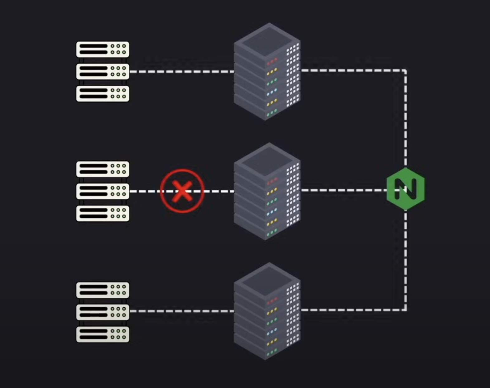
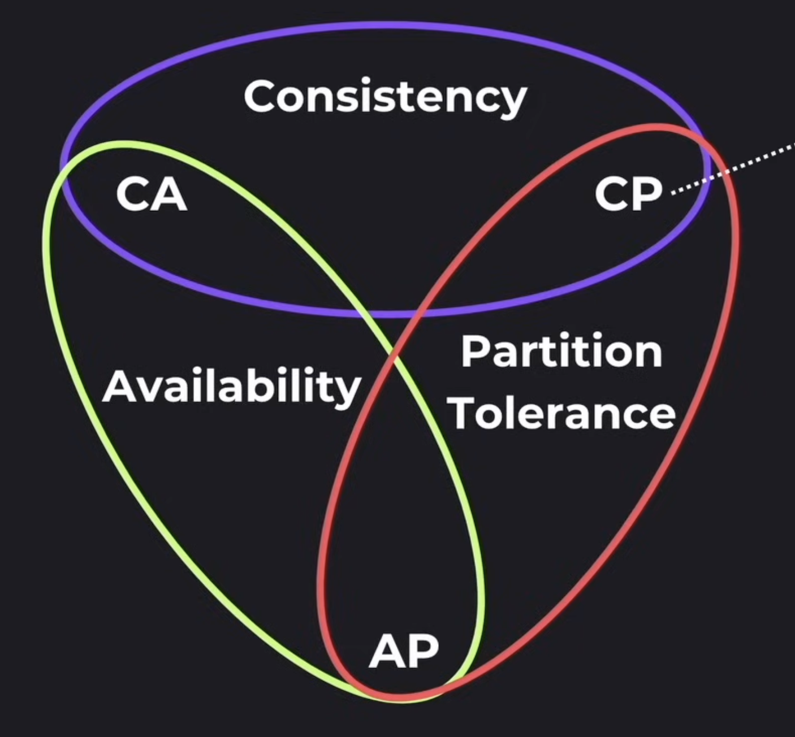
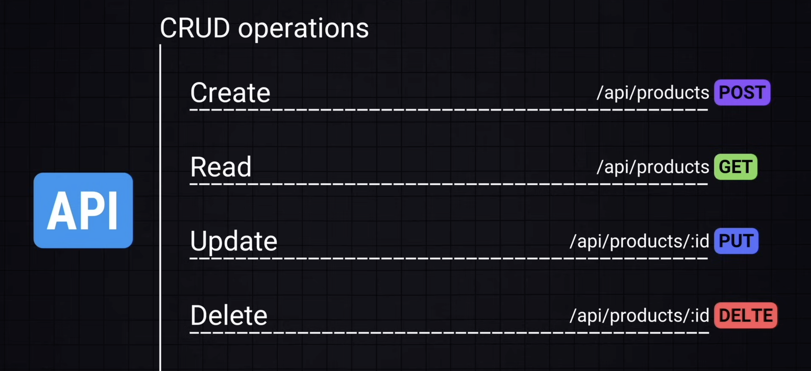
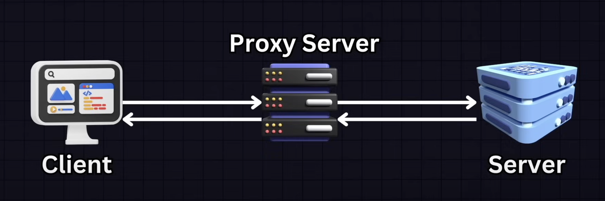

# System Design

- It's about architecting scalable, reliable, and efficiency systems
- It handles: large-scale traffic to optimizing databases

## Table of Contents

- [1. Main Concepts Overview](#1-main-concepts-overview)
  - [1.1. Scalability](#11-scalability)
  - [1.2. Load balancing](#12-load-balancing)
  - [1.3. Database design](#13-database-design)
  - [1.4. Caching](#14-caching)
  - [1.5. Message queues and event-driven architecture](#15-message-queues-and-event-driven-architecture)
  - [1.6. Microservices vs. Monoliths](#16-microservices-vs-monoliths)
  - [1.7. Consistency & Availability (CAP Theorem)](#17-consistency--availability-cap-theorem)
  - [1.8. CDN & Edge computing](#18-cdn--edge-computing)
  - [1.9. Security and authentication](#19-security-and-authentication)
  - [1.10. Observability & Monitoring](#110-observability--monitoring)
- [2. Computer architecture](#2-computer-architecture)
  - [2.1. Storage: where data is stored](#21-storage-where-data-is-stored)
    - [2.1.1. Hard drive (non-volatile)](#211-hard-drive-non-volatile)
    - [2.1.2. RAM (Random access memory) (volatile)](#212-ram-random-access-memory-volatile)
    - [2.1.3. Cache](#213-cache)
  - [2.2. CPU: where data is processed](#22-cpu-where-data-is-processed)
  - [2.3. Motherboard](#23-motherboard)
- [3. High-level Architecture of a Production App](#3-high-level-architecture-of-a-production-app)
  - [3.1. CI/CD: Continuous Integration/Continuous Deployment (Jenkins, GH Actions)](#31-cicd-continuous-integrationcontinuous-deployment-jenkins-gh-actions)
  - [3.2. Load balancers (Nginx)](#32-load-balancers-nginx)
  - [3.3. Storage](#33-storage)
  - [3.4. Logging and monitoring (PM2, Sentry)](#34-logging-and-monitoring-pm2-sentry)
  - [3.5. Alerting services](#35-alerting-services)
- [4. Pillars of System Design](#4-pillars-of-system-design)
  - [4.1. What makes a good design? (SMER)](#41-what-makes-a-good-design-smer)
  - [4.2 Key processes of system design](#42-key-processes-of-system-design)
  - [4.3 CAP Theorem](#43-cap-theorem)
    - [4.3.1 Consistency](#431-consistency)
    - [4.3.2 Availability](#432-availability)
    - [4.3.3 Partition tolerance](#433-partition-tolerance)
  - [4.4 Speed](#44-speed)
    - [4.4.1 Throughput](#441-throughput)
    - [4.4.2 Latency](#442-latency)
- [5. Networking basics](#5-networking-basics)
  - [5.1 IP Address](#51-ip-address)
  - [5.2 Data packet](#52-data-packet)
  - [5.3 Layers (from bottom to top)](#53-layers-from-bottom-to-top)
  - [5.4 Application layer (HTTP, WebSockets, WebRTC, MQTT, etc)](#54-application-layer-http-websockets-webrtc-mqtt-etc)
    - [5.4.1 Email related protocols](#541-email-related-protocols)
    - [5.4.2 File transfer](#542-file-transfer)
- [6. API Design](#6-api-design)
  - [6.1 API Paradigms](#61-api-paradigms)
    - [Rest](#rest)
    - [GraphQL](#graphql)
    - [gRPC (Google Remote Procedure Call)](#grpc-google-remote-procedure-call)
  - [6.2 Good Practices](#62-good-practices)

## 1. Main Concepts Overview

### 1.1. Scalability

- Vertical scaling (scaling up): Adding more resources to a single server (CPU, RAM)
- Horizontal scaling (scaling out): Adding more machines to handle load (distributed architecture)

### 1.2. Load balancing

- Distributes incoming traffic across multiple servers to ensure availaibility and reliability
- Techniques:
  - Round Robin: requests distributed sequentially
  - Least connections: routes to the server with fewer connections
  - Consistent hashing: ensures requests from the same client go to the same server

### 1.3. Database design

- SQL(Relational): Structured schema (MySQL, PostgresSQL)
- NoSQL(Non-relational): Flexible schema (MongoDB)
- Sharding: splitting a database into smaller pieces
- Replication: duplicating data across multiple servers for redundancy
- Indexing: improves query performance

### 1.4. Caching

- Stores frequently accessed data to reduce load on databases
- Techniques:
  - Client-side caching (e.g., browser caching)
  - CDN (Content delivery network): cached data closer to users
  - Application-level cache (e.g., Redis, Memcached)
  - Database cache: cached query results

### 1.5. Message queues and event-driven architecture

- Message queues: (RabbitMQ, Kafka, SQS): Async processing and decoupling services
- Pub/Sub model: Publishers send messages; subscribers process them

### 1.6. Microservices vs. Monoliths

- Monolithic architecture: one large application with all services together
- Microservices architecture: independent, loosely couple services communicating via APIs

### 1.7. Consistency & Availability (CAP Theorem)

- Consistency: All nodes see the same data at the same time
- Availability: system remains operational despite failures
- Partition tolerance: system continues working despite network failures
- Trade-offs: you can only choose 2 of the 3

### 1.8. CDN & Edge computing

- CDN (Content delivery network: Cloudflare, Akamai): Distributes static content to server closer to users
- Edge computing: Processing data near the user instead of a central server

### 1.9. Security and authentication

- OAuth2, JWT: Secure authentication mechanisms
- Rate limiting: prevents abuse (e.g., API throttling)
- Encryption: Data security in transit (TLS/SSL) and at rest

### 1.10. Observability & Monitoring

- Logging (ELK Stack, Datadog): tracks system activity
- Tracing (Jaeger, OpenTelemetry): understands request flow
- Metrics (Prometheus, Grafana): tracks performance

#### Summary

- Scalability: handling growth (vertical vs. horizontal)
- Loading balancing: distributing traffic
- Databases: SQL vs. NoSQL, sharding, replication
- Caching; storing frequently accessed data
- Messaging queues: async processing
- Microservices: decoupling services
- CAP Theorem: trade-offs in distributed systems
- Security: authentication & rate limiting
- Monitoring: logging, tracing, and metrics

## 2. Computer architecture

- Computers function through a layered system, each optimized for varying tasks
- At the core:
  - computers understand only 0s and 1s
  - bit: 0 or 1
  - byte (8 bits): represent a single character (A, 1)

### 2.1. Storage: where data is stored

- To store the bits, we use computer disk storage

#### 2.1.1. Hard drive (non-volatile)

- Doesn't require power to retain its content (non-volatile)
- HDD: speed varies from 80 MB/s to 160 MB/s
- SSD: speed varies from 500 MB/s to 3,5k MB/s
- Long-term memory

#### 2.1.2. RAM (Random access memory) (volatile)

- Requires power to retain its content (volatile)
- It holds data structures, variables and application data
- Deals with data that is currently in use or being processed
- Short-term memory
- Reading speed varies from 5k MB/s upwards

#### 2.1.3. Cache

- Smaller than RAM, usually measured in MBs
- CPU checks this first
- Reduces average time to access data

### 2.2. CPU: where data is processed

- Brain of the computer
- Fetches, decodes and executes instructions
- Process operations defined in programs
- To process information written in high-level languages, the instructions are compiled
- It can read/write from Cache, RAM, Disk

### 2.3. Motherboard

- Connects everything (hard-disk, ram, cache and CPU)
- Provides the pathways that allw the data flow between these components

## 3. High-level Architecture of a Production App

### 3.1. CI/CD: Continuous Integration/Continuous Deployment (Jenkins, GH Actions)

- Code goes from repo to a series of tests and pipeline checks onto production server without manual intervention
- Stack: Jenkins, Github actions
- Automates deployment processes

### 3.2. Load balancers (Nginx)

- Ensures user requests are evenly distributed across multiple servers
- Maintains smooth user experience even during traffic spikes

### 3.3. Storage

- Where the data is stored
- It's connected with production server

### 3.4. Logging and monitoring (PM2, Sentry)

- Ensures everything runs smoothly
- Check microinteractions, storing logs and analyzes data

### 3.5. Alerting services

- Warns of failing requests or anomalies
- Pushes notifications to keep users informed

## 4. Pillars of System Design

### 4.1. What makes a good design? (SMER)

- Scalability: system grows with user base
- Maintainability: future developers can understand and improve system
- Efficiency: making the best use of our resources
- Reliability: planning for failure and building a system that behaves well when things don't work

### 4.2 Key processes of system design

- Moving data: ensuring data can flow well from one part of the system to another
  - Speed and security
- Storing data: access patterns, indexing strategies, backup solutions
  - Security and availability
- Transforming data: taking raw data and transforming it into meaningful information

### 4.3 CAP Theorem

- It's a set of principles that guide us in making informed tradeoffs bewtween 3 key aspects of a distributed system: Consistency, Availability and Partition Tolerance
- According to the CAP theorem, a distributed system can achieve ONLY 2 of the 3 at the same time
- CAP theorem describes that it's not about finding the perfect solution, but the best solution for our specific use case

#### 4.3.1 Consistency

- Ensures that all nodes in the distributed system have the same data at the same time
- One change to one nodes is reflected across all nodes
- Ex: One change made to a Google docs is seen instantly by others

#### 4.3.2 Availability

- System is always operational and responsive to requests no matter what is happening the scenes
- Is our system up and running when our users need it?
- It's usually measured in % and aims at the golden 5 9's availability: **99.999%**
  - 99.9% availability: 8.76 hours of downtime allowed per year
  - 99.999% availability: 5 min. of downtime per year
- It's measured in uptime/downtime

##### 4.3.2.1 SLO - Service level objectives (uptime)

- Setting goals for our systems performance and availability
- Ex: our service should respond to request within 300ms 99.9% of the time

##### 4.3.2.2 SLA - Service level agreements (downtime)

- Formal contract with our users. They define the minimum level of service we're committing to provide
- If we affirm we offer 99.99% availability, but fail to do it, we might be request to pay refunds or compensations

##### 4.3.2.3 Reliability, Fault Tolerance, Redundancy

- Reliability: ensures the system works consistently
- Fault tolerance: when things go wrong, how well our system handles unexpected failures or attacks
- Redundancy: if one part of our system fails, there's another ready to take its place

#### 4.3.3 Partition tolerance

- The ability of a system to continue functioning even when a network partition happen
- If there is a disruption in communication between the nodes, the system still works
  
- Ex: A group chat that continues happening even though one person loses connection

### 4.4 Speed

#### 4.4.1 Throughput

How much data our system can handle over a certain period of time

##### 4.4.1.1 Server Throughput

- How many client requests a server can handle in a given time frame
- Measured in requests per second (RPS)

##### 4.4.1.2 DB Throughput

- How many number of queries a database can process in a second
- Measured in queries per second (QPS)

##### 4.4.1.3 Data Throughput

- The amount of data transferred a network or processed by a system in a given period of time
- Measured in bytes per second (B/s)

#### 4.4.2 Latency

How long it takes to handle a single request

## 5. Networking basics

- How computers communicate with each other

### 5.1 IP Address

- Unique identifies for each device on a network
- IPv4 - 32-bit -> 4B available unique addresses
- IPv6 - 128-bit -> 340T available unique addresses
- When computers communicate over a network, they send/receive packets of data

### 5.2 Data packet

- Unit of data transmitted over a network
- It consists of 3 main sections:

1. Header (metadata): info for routing + handling the packet
   - Source & Destination IP Address
   - Protocol information (TCP, UDP, etc)
   - Packet number (for reassembly in case of fragmentation)
   - Checksum (error detection)
   - TIME-to-Live (TTL) (prevents infinite loops)
2. Payload (data): the actual data being transmitted (e.g., webpage, email, file, etc)

### 5.3 Layers (from bottom to top)

1. Physical layer: Transmits raw bit stream over a physical medium

   - Physical structure
   - Fiber, Wireless, Hubs, repeaters

2. Data link layer: Defines the format of data on the network

   - Frames
   - Ethernet, PPP, switch, bridges

3. Network layer: Dedices which physical path the data will take

   - Packets
   - IP, ICMP, IPSec, IGMP
     - Public IP addresses: are unique across the internet
     - Private IP addresses: are unique within local network
     - IP + Port = unique identifier for a network service
     - Ports:
       - HTTP: 80
       - HTTPS: 443
       - SSH: 22
       - MYSQL: 3306

4. Transport layer: Transmits data using transmission protocols including TCP and UDP

   - End-to-end connections
   - TCP, UDP
   - TCP (Transmission control protocol): Ensures reliable communication. Makes sure not only your packet arrives, but it arrives consitently
     - Established 3-way connection (3-way handshake) before sending data (SYN / SYN + ACK + ACK)
     - Used when data consistency is more important than speed
   - UDP (User datagram protocol): Faster, but less reliable
     - Doesn't establish 3-way connection before sending data
     - Doesn't guarantee the delivery or order of the packets
     - Used for time sensitive communications (e.g., video calls, live streaming)
     - Used when speed is more important than data loss

5. Session layer: Maintains connection and is responsible for controlling ports and sessions

   - Sync & send to port
   - API's, Sockets, WinSock

6. Presentation layer: Ensures data is in a usable format and is where data encryption occurs

   - Syntax layer
   - SSL, SSH, IMAP, FTP, MPEG, JPEG

7. Application layer: Human-computer interaction layer, where applications can access the network services

   - End user layer
   - HTTP, FTP, IRC, SSH, DNS
     - DNS (Domain name system): Transforms human-friendly names into IP addresses

### 5.3 Application layer (HTTP, WebSockets, WebRTC, MQTT, etc)

- HTTP: HyperText Transfer Protocol:

  - Request/response protocol
  - A conversation with no memory. Each interaction is separate with no recollection of the past (stateless)
  - Each request contains the necessary information

- Websockets: Realtime communcation:

  - Two-way communication
  - Single, long-live connection
  - Used for live applications: chat, sport updates, stock market feeds. (where the action never stops)

#### 5.3.1 Email related protocols

- SMTP: Email transmission across the internet
- IMAP (Internet message access protocol): Used to retrieve emails from a server
- POP3 (Post office protocol version 3): Used for downloading emails from a server

#### 5.3.2 File transfer

- FTP (File transfer protocol): Transferring files over the internet (e.g., uploading files to a server, download files from a server)
- SSH (Secure shell): Command-line login and file transfer
- WebRTC: Enables browser-to-browser applications for voice calling, video chat, and file sharing (e.g., video chats)
- MQTT: Lightweight messaging protocol for devices with low processing power (e.g.,IoT devices)
- RPC (Remote procedure call): Executing code in one machine from another as if it were from the original machine

## 6. API Design

- How CRUD operations are exposed to the UI
  

### 6.1 API Paradigms

#### Rest

- Stateless: every request must contain all information needed to understand and allow operation
- Standard HTTP Methods
- Can lead to over/under-fetching
- Normally uses JSON

#### GraphQL

- Avoids over/under-fetching
- Strongly typed schema based queries
- Queries can impact server performance
- Only POST requests
- Responds with HTTP 200 -- even in case of errors

#### gRPC (Google Remote Procedure Call)

- Built on HTTP/2: multiplexing/server push
- Uses protocol buffers
- Efficient
- Less human-readable
- Requires HTTP/2 support

### 6.2 Good Practices

- Backward compatibility
- Rate limiter
- CORS (Cross-Origin Resource Sharing): controls which domains can have access to the API

## 7. Caching and CDN (Content Delivery Networks)

### 7.1 Caching

- Used to improve performance and efficiency
- Stores a copy of data in a temp storage (cache)
- By taking this temp data, future requests can be served faster

### 7.2 Caching types

#### 7.2.1. Browser caching

- This cache is store in a directory on the computer's hard drive managed by the browser
- Stores HTML, CSS, and JS files on the user's local machine
- Cache ratio = cache hits / (cache hits + cache misses) => higher-ratio represents a more effective cache
  - Cache hit: requested data is found in cache
  - Cache miss: requested data isn't found in cache. New fetch required
- X-Cache header: tells if cache was hit or no

#### 7.2.2. Server caching

- Frequently accessed data is stored on the server
- Either stored on the server or on a separate cache server
- Server checks the cache before querying the database

  - If data is in cache, it is returned directly.
    Otherwise, server queries the database, returns it to the user and stores it in the cache
  - Tech: Redis

##### 7.2.2.1. Types of cache writing

- Write-around cache: data is written directly to permanent storage, by passing the cache
  - Used when write performance is less critical
- Write-through cache: data is written simultaneously to db and cache
  - Ensures data consistency, but can be slower than `write-around cache`
- Write-back cache: data is first written on cache, then db
  - Improves write performance, but risk of losing data in case server cache crashes

What about when the cache is full?

- There are policies to decide what to do with the cache once it's full. E.G.:
  - Least Recently Used (LRU)
  - First in First Out (FIFO)
  - Least Frequently Used (LFU)

#### 7.2.3. Database caching

- Caching database query results to improve performance of database-driven applications
- It's done within the db system itself or via an external caching layer (redis, mcache)
- When a query is made, we first check the query to see if the result is cached
  - If it is, return cached data (avoid the need to consult db)
  - If not found, query the database and cache the result

### 7.2.4. CDN

- It's also a type of caching
- A network of servers distributed geographically
- Commonly used to serve static files (JS, HTML, CSS, images or videos)
- Good to ensure high availability and performance for users across the globe

#### Benefits of CDN

- Reduced latency
- High availability
- Improved security

#### When should we use origin server instead of CDN?

- Serving dynamic content that changes frequently or is personalized for individual users
- Handling tasks that require real-time processing or access to up-to-date data
- Application requires complex server-side logic that can't be replicated or cached by a CDN

## 8. Proxy server

- Act as an intermediary between a client requesting a resource and the server providing the resource
- Client -> proxy server -> server and back

### 8.1 Usage of proxy server

- Caching resources
- Anonymizing requests
- Load balancing

### 8.2 Types of proxy servers

- Forward proxy: sits in front of clients and is used to send requests to other servers
  - Often used within internal networks to control internet access
  - Acts as a middle-layer between client and server
  - Hides the IP of the client, and shows its own IP to the receiving server
  - Examples:
    - Instagram proxies: managing multiple accounts without getting flagged
    - Internet use control
    - Caching
    - Anonymizing web access
- Reverse proxy: sits in front of one or many web servers intercepting requests from the internet
  - Used for load balancing, web acceleration and as security layer
  - While a forward proxy hides the client identity, a reverse proxy hides the server identity (or the existence of multiple servers behind it)
  - Distributes requests across multiple servers (load balancing)
  - Examples:
    - Load balancers
      - Spread requests effectively
      - Increases capacity and reliability of applications
    - CDNs
    - firewalls (web application firewalls)
- Open proxy: allows any user to connect and utilize the proxy server
  - Often used to anonymize web browsing and bypass content restrictions
- Transparent proxy: passes along requests and resources without modifying them. It's visible to the client
  - Often used for caching and content filtering
- Anonymous proxy: doesn't show the IP
  - Used for anonymous browsing
- Distorting proxies: provides an incorret original IP to the destination server
  - Similar to anonymous proxing, but with purposeful IP misinformation
- High-anonymity proxy: ensure maximum anonymity

## 9. Load balancers

### 9.1 Load balancers algorithms

1. Round robin: each server in the pool gets a request in sequential, rotating order

   - Good for: servers with similar specifications and when the load is uniformally distributable

2. Last connection: directs traffic to the server with the fewest active connections

   - Good for: long tasks or when the load isn't evenly distributed

3. Least response time: chooses the server with the lowest response time and fewest active connections

   - Good for: providing the fastest response to requests

4. IP Hashing: decides the server based on the hash of the client's IP address.

   - Good for: session persistence and when there's the need for the client to connect consistently to the same server

5. Weighted algorithms: servers are assigned weigths (typically based on performance) and servers that have the most capacity handle most requests

   - Good for: servers in the same pool who have different capabilities

6. Geographic: directs requests to servers closest to the client geographically

   - Good for: global servers that need low latency

### 9.2 Health check

- It's important to measure the health of servers to ensure that the load balancer only forwards requests to online and responsive servers
- What about the situation when the load balancer goes down?
  - The load balancer is very effective in distributing traffic, however, it is, by its nature, a single-point of failure
  - How to solve it?
    - 1. Redundant load balancing
    - 2. Health checks and monitoring of the load balancers themselves
